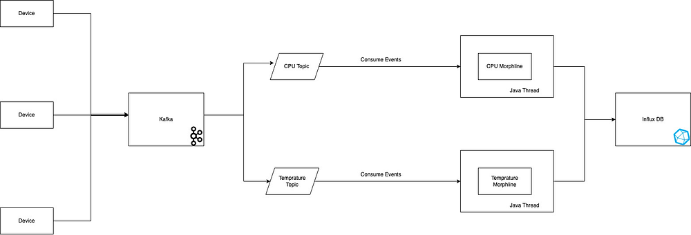

# Data Parser using Morphline

This is a Java service that will read events from the Kafka topics and parse them using Morplines.

The Consumer service will read the events from the Kafka topics, parse them through their respective Morphlines and store them into InfluxDB.

Architecture:



This repo is already created as ready to run, to start the Kafka and InfluxDB run the following command

```
docker-compose -f .\kafka\docker-compose.yml up 
```

The Java service configuration file [consumer_config.json](src%2Fmain%2Fresources%2Fconsumer_config.json)

Expose the following environment variables:
```
APP_CONFIG_FILE=src/main/resources/consumer_config.json;
INFLUXDB_TOKEN=<bucket token>;
KAFKA_PROPERTIES_FILE=src/main/resources/kafka.properties;
INFLUXDB_ORG=demo-org;
INFLUXDB_URL=http://localhost:8086/
```
> Note: You may need to  update influxdb variables based on your setup

Once the application is up and running, we can use the kafka-console-producer to push some events in to the topic

```
docker exec -it broker /bin/kafka-console-producer --broker-list localhost:9092 --topic cpu
```

Once the events are processed, you can see then in your InfluxDB UI.
